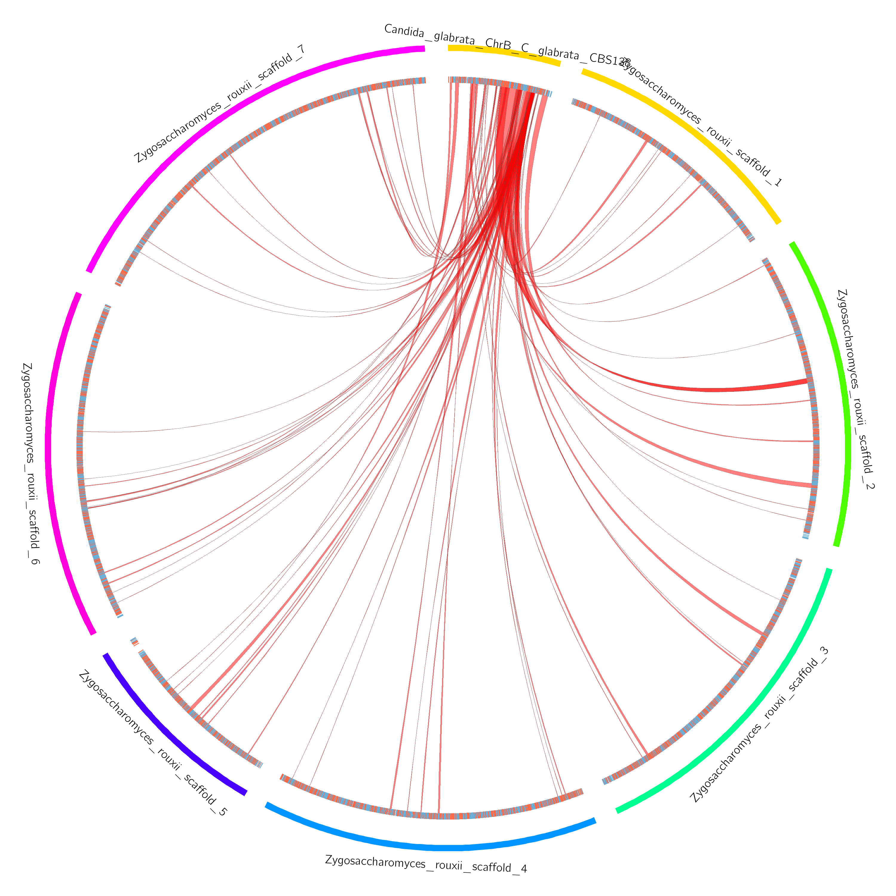

# Proteny
A tool to analyze synteny at the protein level. We develop an algorithm to detect statistically significant clusters of exons between two proteomes.
The tool provides algorithms to quickly detect and visualize results in order to support conclusions from genomic data.

The method discovers clusters of hits from a bi-directional BLASTp of translated exon sequences in two organisms.
A dendrogram for hits is built based on genomic distances between hits, and cut based on significance of a cluster score based on a permutation test at each node in the tree.
The result is a set of large clusters describing high exonic conservation.

## Changes in current version
The previous release of Proteny [0.05](https://github.com/thiesgehrmann/proteny/tree/0.05) had many problems.
Specifically it relied on packages that were difficult to install, or were not running correctly on different platforms, or with different versions of numpy.

The current release [0.1](https://github.com/thiesgehrmann/proteny/tree/0.1) has been completely re-implemeneted to remove these dependencies, and to facilitate cross-platform behaviour.
Therefore, it has been implemented in Snakemake, together with the conda environment manager.
This removes the burden on the user having to install different dependencies manually.

### Missing features in the current release
 * Permutations are not parallelized
 * Chromosome specific colors for each link in chromosome circos view
 * Region circos view

## Getting started

### Installation

Proteny is implemented in the Snakemake framework, and delegates the package dependecies to snakemake, which installs the package dependencies (from conda).
If you wish to install all dependencies yourself, however, you can find a comprehensive list [here](pipeline_components/conda.yaml)
Otherwise, you can install these two packages, and the rest will be taken care of for you:

 * [Snakemake](http://snakemake.readthedocs.io/en/stable/)
 * [Conda](https://conda.io/miniconda.html)

These two packages will take care of the remaining dependencies.

### Example dataset

Provided is a small example using the genomes of
 * [Candida Glabrata CBS138](http://www.candidagenome.org/download/sequence/C_glabrata_CBS138/current/)
 * [Zygosaccharomyces rouxii CBS732](http://genome.jgi.doe.gov/Zygro1/Zygro1.download.html)

To download and run the example dataset, run the following on your command line:

```bash
  git clone https://github.com/thiesgehrmann/proteny.git
  cd proteny
  ./proteny -t 10 example_config.json
```

### Example output

After running proteny, you will find circos plots in **exampleOutput/run/circos**, such as this one:


## Running your own data

To run the pipeline with your own data, you simply need to define your own configuration file.
Basically, you need to provide a genome FASTA file and a GFF3 file of genes for each genome that you wish to use.
As mentioned in the paper, you may also need to modify the conservation threshold for your pair of organisms (if they are very diverged, you can leave it at 0.5).
Te configuration is very straightforward, and it is described in JSON format (see below).


```json
{

  "outdir": "outDir",

  "genomes" : {
    "genome_1" : { 
      "name"   : "Genome1",
      "genome" : "path/to/genome1/genome.fasta",
      "gff"    : "path/to/genome1/genes.gff3" 
    },

    "genome_2" : { 
      "name"   : "Genome2",
      "genome" : "path/to/genome2/genome.fasta",
      "gff"    : "path/to/genome2/genes.gff3"
    }
  },

  "cons_thresh" : 0.5

}

```

## Output

Proteny identifies statistically significantly conserved clusters, and outputs information about these clusters in: **outdir/run/proteny/proteny.sigClusts.tsv**

In addition to this, proteny produces circos visualizations for the discovered clusters, placing them in: **outdir/run/circos**

## FAQ

Please check our list of [Frequently Asked Questions](doc/faq.md)
 
